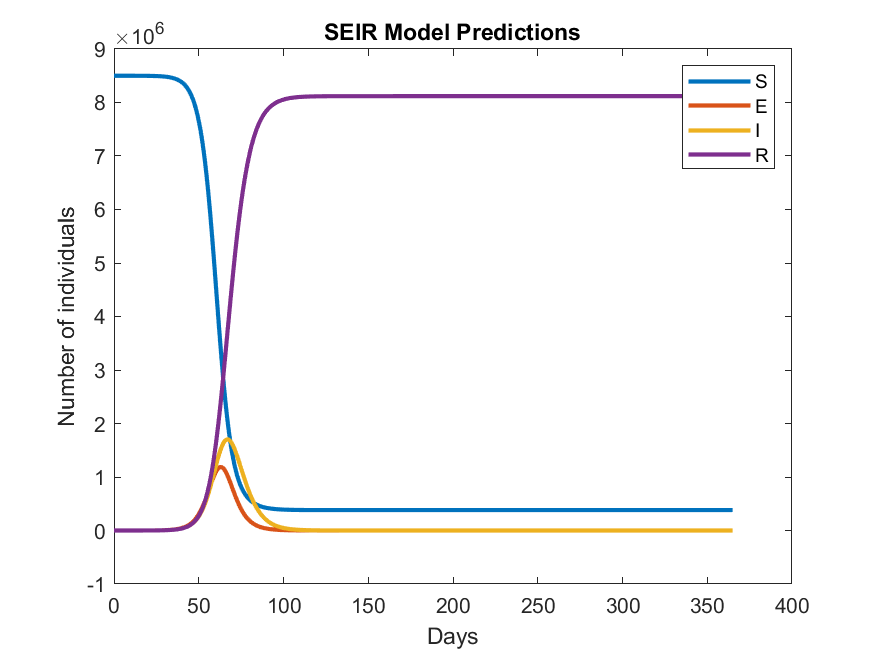

# modeling-disease-spread-using-an-SEIR-model

This is a simple SEIR model of disease spread, implemented in MATLAB®. This approach is widely used to analyze infection data during the different stages of an epidemic outbreak. The population is divided into Susceptible (S), Exposed (E), Infectious (I), and Recovered (R) individuals.

This Live Script provides a basic SEIR model overview and an example of how you might get some graphical results using MATLAB.

The model equations in the Live Script that make up the SEIR model are based on [this article](https://www.sciencedirect.com/science/article/pii/S2468042717300234).

**Product Requirement** : MATLAB (Tested with R2021b)
